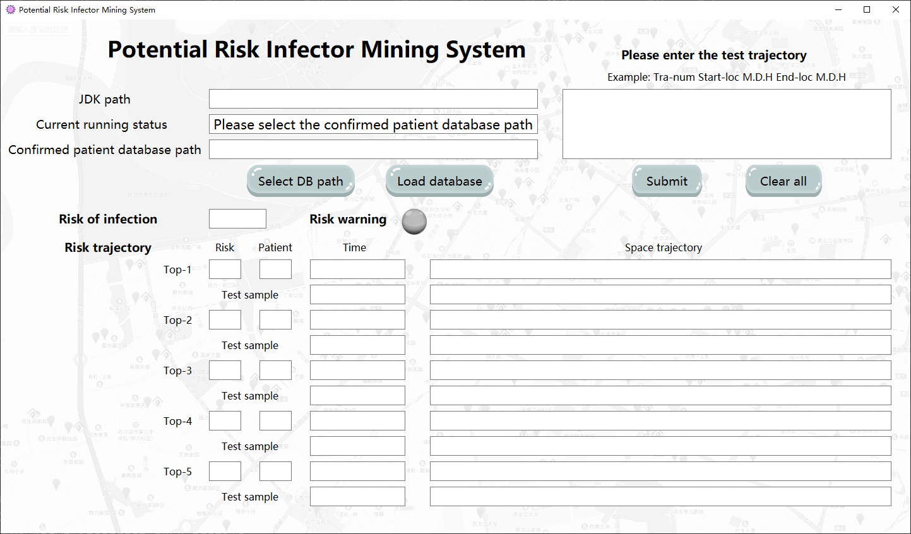
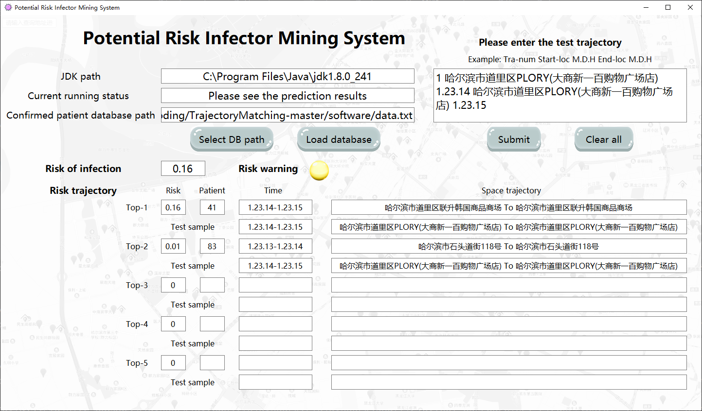

# Potential-Risk-Infector-Mining-System-of-COVID-19

This repository holds the codebase, dataset and software of Potential Risk Infector Mining System. The system works to evaluate infection risk by matching spatio-temporal trajectory, to find potentially infected patients.

The software takes the patients' trajectory in Harbin (Heilongjiang Province, China) as the sample database. After test trajectorys are input, the system outputs the risk estimation and warning instructions according to every spatio-temporal trajectory.

Author: Xiaohua Qian, Rui Guo, Xiahan Chen, Qingzhong Chen.



## Prerequisites
Our codebase is based on **Python3.7**. There are a few dependencies to run the code and software. The major libraries we depend are
- pyspark
- java jdk 1.8

## Usage
The software requires the user to select the patients' trajectory database to match the test dataset. The software will automatically convert them into the location coordinates encoded by longitude and latitude and timestamps. User then input the spatio-temporal trajectory of test sample, including location and time of start and end, for infection risk assessment (Red light indicates high risk. Yellow light indicates medium risk. Gellow light indicates low risk).

## Demo
To quickly run the demo **main.py**

make sure you have the demo database file **data.txt** and **test1-3.txt** from data folder

Start the main.exe:

- input the ```JDK path``` (e.g. D:\Program Files\Java\jdk1.8.0_241)

- select the database path to fill the ```Confirmed patient database path```

- copy and paste the ```test trajectory``` from the file test*.txt, then ```submit```

- get the ```infection risk results``` and ```warning instructions```



## Acknowledgement
Thanks for the open-source code (https://github.com/Gooong/TrajectoryMatching) based on high-performance spatiotemporal trajectory matching across heterogeneous data sources (Gong et al. 2020). Thanks for the spatio-temporal trajectory map (http://39.96.43.154) of COVID-19 patients in Harbin developed by the research center for social computing and information retrieval of Harbin Institute of Technology (HIT-SCIR).

## Contact
For any question, feel free to contact
```
Rui Guo (software): guoruimm1231@outlook.com
Xiahan Chen (algorithm): chenxiahan@sjtu.edu.cn
Qingzhong Chen(data): chenqz1998@foxmail.com
```
